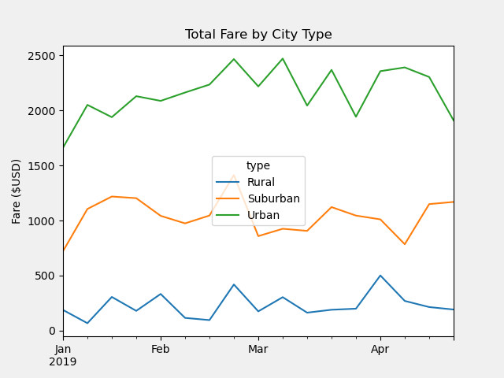

# Pyber Analysis

## Overview
Omar and I have assisted V. Isualize to visualize their ride-sharing data and trends using Python coding in Pandas and Matplotlib. We provided a (cleaned-up) ride sharing summary by city-type and a line-chart showing total fares by city type. 

## Results

### Rural Customers
Over the course of the first four months of 2019, rural customers used the service the least overall with the least rides, drivers, and total fares. The average fare per ride and per driver were highest, likely because of the distance travelled by each customer. 

### Urban Customers
Urban customers used the service the most overall in the first four months of 2019. They had the highest total rides, drivers, and fares even though they had the smallest average fare per ride and per driver. This also makes sense due to the high density of both people and vehicles in urban areas; while customers may not need to go very far (low average fare per ride and driver), there are WAY more people who would rather grab a ride somewhere than try to find parking for their own car (high number of total rides, drivers, and fares).

### Suburban Customers
Suburban customer numbers fell between rural and urban customers in every category. Where suburban numbers were interesting is in the weekly fares summary (shown below). First, while rural and urban total weekly fares started and ended the quarter within a couple hundred dollars of each other, suburban total weekly fares ended the quarter $400 over where they started the quarter. Also, Suburban total weekly fares experienced the sharpest drop between the end of February and the beginning of March when they dropped almost $600.

### Weekly fares by city type

## Summary
Without changes to the business model, it's unlikely that rural ride-sharing will ever come close to giving you numbers like Suburban and Urban locations. Week-to-week, the rural numbers indicate it might be worth looking into whether it's worth the time and investment at all. Further investigation into your suburban numbers for March might help tell you why the numbers were so low, especially since your urban numbers didn't show a similar drop over the same time period. There also appears to be somewhat inconsistent usage of your service over these four months regardless of city type, and it might be worth looking into why that might be.